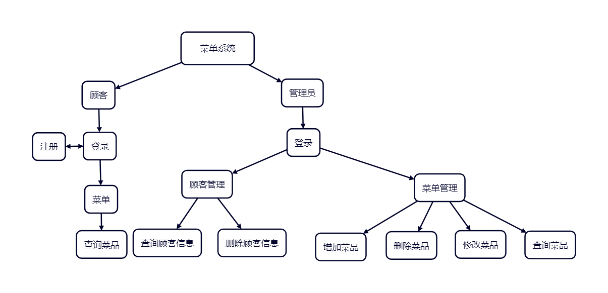
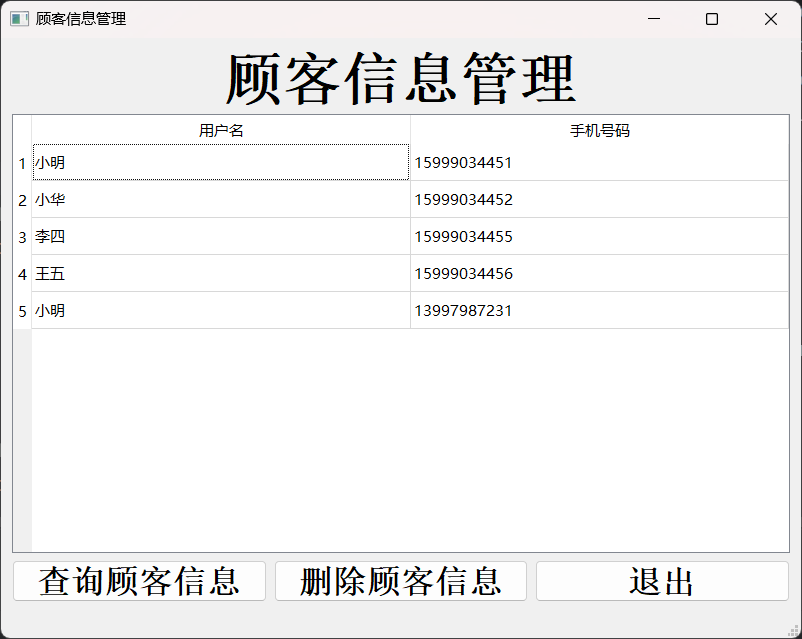

# MenuSystem

## 一、开发环境说明

1.使用Python语言进行系统实现（Python版本为3.11），使用PyCharm软件进行开发。

2.使用MySQL进行数据存储（MySQL版本为8.0.37），使用Python库PySQL进行数据库的连接和操作。


3.使用Python库PyQt5和Qt Designer进行界面设计，其中Qt Designer用于拖拽控件进行界面设计，PyQt5主要进行界面控件背后逻辑设计，比如界面跳转、表格中数据显示、按钮点击后的自定义操作等。


## 二、系统总体分析

### 1.系统主要功能

​	顾客可以进行登录、注册和查看菜单，管理员可以进行登录、对顾客信息进行查看和删除以及对菜单进行增删改查。

### 2.系统逻辑

​	系统逻辑图如下：



### 3.数据表设计

- 菜品类型表`food_type`设计如下：

  | 字段名称  | 类型         | 是否为空 | 主键 | 说明         |
  | --------- | ------------ | -------- | ---- | ------------ |
  | t_id      | INT          | 否       | t_id | 菜品类型ID   |
  | type_info | VARCHAR(255) | 否       |      | 菜品类型描述 |

* 菜品信息表`food_info`设计如下：

  | 字段名称   | 类型         | 是否为空 | 主键 | 说明       |
  | ---------- | ------------ | -------- | ---- | ---------- |
  | f_id       | INT          | 否       | f_id | 菜品ID     |
  | f_name     | VARCHAR(255) | 否       |      | 菜品名称   |
  | price      | FLOAT        | 否       |      | 菜品价格   |
  | t_id       | INT          | 否       |      | 菜品种类   |
  | food_info  | VARCHAR(255) | 否       |      | 菜品介绍   |
  | is_special | BOOL         | 否       |      | 是否招牌菜 |

* 顾客信息表`custom_info`设计如下：

  | 字段名称     | 类型         | 是否为空 | 主键 | 说明     |
  | ------------ | ------------ | -------- | ---- | -------- |
  | c_id         | INT          | 否       | c_id | 顾客ID   |
  | c_name       | VARCHAR(255) | 否       |      | 顾客名称 |
  | password     | VARCHAR(255) | 否       |      | 顾客密码 |
  | phone_number | VARCHAR(255) | 否       |      | 手机号码 |

* 管理员信息表`admin_info`设计如下：

  | 字段名称 | 类型         | 是否为空 | 主键 | 说明       |
  | -------- | ------------ | -------- | ---- | ---------- |
  | a_id     | INT          | 否       | a_id | 管理员ID   |
  | a_name   | VARCHAR(255) | 否       |      | 管理员名称 |
  | password | VARCHAR(255) | 否       |      | 管理员密码 |

## 三、数据库创建及相关代码

### 1.创建数据库和数据表

​	创建数据库和数据表的完整代码如下：

```mysql
# 创建数据库menu_db
CREATE DATABASE menu_db;
USE menu_db;
CREATE TABLE custom_info  # 顾客信息表
(
    `c_id`     INT PRIMARY KEY AUTO_INCREMENT,  # 顾客id 主键 递增
    `c_name`   VARCHAR(255) NOT NULL,  # 用户名 可以重名
    `password`  VARCHAR(255) NOT NULL,  # 用户密码
    `phone_number`  VARCHAR(255) UNIQUE NOT NULL # 手机号 唯一
);
CREATE TABLE admin_info  # 管理员信息表
(
    `a_id`     INT PRIMARY KEY AUTO_INCREMENT, # 管理员id 主键 递增
    `a_name`   VARCHAR(255) NOT NULL ,  # 管理员登录名称
    `password` VARCHAR(255) NOT NULL  # 管理员登录密码
);
# 1 饮品  2 汤类  3 凉菜  4 火锅  5 炒菜
CREATE TABLE food_type  # 菜品种类表
(
    `t_id`  INT PRIMARY KEY AUTO_INCREMENT,  # 菜品类型id 主键 递增
    `type_info`  VARCHAR(255)   UNIQUE NOT NULL# 菜品类型描述 不能为空
);
CREATE TABLE food_info  # 菜品信息表
(
    `f_id`  INT PRIMARY KEY AUTO_INCREMENT,  # 菜品id 唯一 递增
    `f_name`    VARCHAR(255)    UNIQUE NOT NULL,  # 菜品名称 不能为空
    `price` FLOAT   NOT NULL,   # 菜品价格 不能为空
    `t_id`  INT NOT NULL ,  # 菜品种类 来自`food_type`表
    `food_info`  VARCHAR(255)    NOT NULL,   # 菜品介绍 不能为空
    `is_special` BOOL DEFAULT FALSE,   # 是否是招牌菜 默认不是
    FOREIGN KEY (`t_id`) REFERENCES `food_type` (`t_id`)  # 外键
);
```

### 2.使用Python连接数据库

​	连接数据库和初始化的主要代码如下：

```python
userName = 'root'  # 数据库用户名
password = 'root3306'  # 密码
databaseName = 'menu_db'  # 创建的数据库
# 电脑中有两个版本的mysql  #5.7版本为3306  #8.0版本为3307
port = 3307  # 端口号
# 创建连接   Connector为自定义类
Connector.connection = pymysql.connect(host='localhost',
                        user=userName, password=password,
				database=databaseName, port=port)

```

## 四、功能实现及主要代码说明

### 1.主界面与菜单系统管理界面

​	主界面与菜单系统管理界面布局相似，其原理也相似。主界面和菜单系统管理界面中的三个按钮分别绑定三个自定义函数，鼠标进行点击时，会分别调用对应的自定义函数。

​	对主界面而言，点击顾客会跳转至顾客登录界面，点击管理员会跳转至管理员登录界面，点击退出则会关闭当前界面。菜单系统管理界面的原理与主界面的类似，点击顾客管理会跳转至顾客管理界面，点击菜单管理则会跳转至菜单管理界面，点击取消会关闭当前界面。

|  |  |
| ------------------------------------------------------------ | ------------------------------------------------------------ |

​	界面跳转功能的实现使用的是`PyQt5.QtCore`中的`pyqtSignal`函数。

```python
# 界面跳转
# 跳转至顾客登录界面
switch_customWindow = pyqtSignal()
# 跳转至管理员登录界面
switch_adminWindow = pyqtSignal()
```

### 2.顾客登录、顾客注册和管理员登录

​	顾客登录、顾客注册与管理员登录三者的界面布局相似，都需要对填入的数据进行合法性检查，比如是否为空等。

​	对顾客登录而言，主要是将填入的用户名、密码和手机号码在数据库中进行查询，若存在则登录成功。对顾客注册而言，首先要去数据库中查询手机号码是否重复，若不重复，则进行数据的插入操作。对管理员登录而言，其原理与顾客登录类似，即将填入的用户名和密码在数据库中进行查询，若存在，则登录成功。

|  |  |  |
| ------------------------------------------------------------ | ------------------------------------------------------------ | ------------------------------------------------------------ |

​	顾客登录时，数据库操作的主要代码如下：（管理员登录时的操作类似）

```python
# 获取当前游标
cursor = self.conn.get_cursor()
sql = "SELECT c_id FROM `custom_info` WHERE c_name = %s AND password = %s AND phone_number = %s"
# 执行查询
cursor.execute(sql, (username, password, phonenumber))
# 只需找一个
result = cursor.fetchone()
```

​	顾客注册时，查询手机号是否重复及插入用户数据的主要代码如下：

```python
# 从数据库中查询手机号码是否重复
cursor = self.conn.get_cursor()
sql = "SELECT c_id FROM `custom_info` WHERE phone_number=%s"
cursor.execute(sql, phonenumber)
result = cursor.fetchone()
# 对result的长度进行判断，再进行下一步操作
# 插入顾客信息
cursor = self.conn.get_cursor()
sql = "INSERT INTO `custom_info` (c_name, password, phone_number) VALUES (%s, %s, %s)"
cursor.execute(sql, (username, password, phonenumber))
```

### 3.菜单界面、菜单管理界面和顾客信息管理界面

​	菜单界面、菜单管理界面和顾客信息管理界面三者都是将数据表中的信息展现在界面的表格中，同时都提供查询功能。菜单界面和菜单管理界面中的查询都是对food_info进行操作，顾客管理界面则是对`custom_info`进行查询。


|  |  |
| ------------------------------------------------------------ | ------------------------------------------------------------ |

​	对顾客使用的菜单界面而言，从food_info表中查询所有的数据，按菜品类型分别显示在界面的表格区域中。左下角是查询菜品按键，点击可弹出查询菜品对话框。菜单管理界面的中间使用表格显示food_info表中的内容，下方前四个按钮分别对应管理员对food_info表中数据的增删改查，并分别跳转至对应的界面。顾客管理界面的原理与菜单管理界面的类似，中间使用表格显示custom_info表中的内容，下方前两个按钮分别对应管理员对custom_info表中对数据的查询和删除。

​	从数据库中查询招牌菜部分代码如下：（其他菜品类型类似）

```python
# 从数据库中查询信息
# 以招牌菜为例
cursor = self.conn.get_cursor()
sql = "SELECT f_name, price, food_info  FROM `food_info` WHERE is_special=%s"
cursor.execute(sql, 1)
result = cursor.fetchall()
```

​	将查询到的数据显示在表格中的部分代码如下：

```python
# 在界面表格中显示数据
row = len(result)  # 获取行数
col = len(result[0])  # 获取列数
self.tableWidget_spesial.setRowCount(row)  # 设置行数
self.tableWidget_spesial.setColumnCount(col)  # 设置列数
self.tableWidget_spesial.setHorizontalHeaderLabels(self.h_table_header)  # 设置表头
for i in range(len(result)):
    for j in range(len(result[0])):
        item = QTableWidgetItem()  # 初始化表格单元对象
        item.setText(str(result[i][j]))  # 设置文本
        self.tableWidget_spesial.setItem(i, j, item)  # 填入单元格
```

### 4.顾客查询菜品、管理员查询菜品和管理员查询顾客信息

​	顾客查询菜品、管理员查询菜品和管理员查询顾客信息都是对数据库进行查询操作。其中顾客查询菜品和管理员查询菜品的对话框布局相同，且查询条件种类相同，操作的表都是`food_info`，因此主要介绍顾客查询菜品的原理。


|  |  |
| ------------------------------------------------------------ | ------------------------------------------------------------ |

​	对顾客查询菜品的对话框而言，顾客可自行选择查询的条件，因此最终的查询语句中的条件部分是几段字符串拼凑而成。使用是列表结构来存放条件部分，当用户选择一个查询条件时，分别将对应的查询语句块、查询值添加到对应的列表中。在拼凑查询语句时，使用AND或者OR对查询语句列表进行连接并转为一个字符串。执行查询语句时，使用元组存放查询值，但元组是常值类型，不可修改，因在添加查询值时，使用列表存放，最后进行查询时，将列表转为元组。

​	管理员查询菜品的原理与顾客查询菜品的原理相同，在此不再赘述。

​	顾客信息查询的条件最多两个，比菜品查询条件简单。管理员可根据手机号码或者用户名称或者两者同时进行查询。在数据库中，用户名称不唯一，手机号码唯一。因此查询结果中，使用手机号查询最多出现一条记录，而使用用户名查询，则可能出现多条记录。

​	其中顾客查询菜品的数据库操作的部分代码如下：（管理员查询菜品和管理员查询顾客信息的代码类似）

```python
cursor = self.conn.get_cursor()
# 前半部分查询语句固定
sql = 'SELECT f_name, price, t_id, is_special, food_info FROM `food_info`'
# 使用AND连接
sql_conclusion = []  # 存放查询语句块
conclusion = []  # 存放查询值
# 菜品类型 使用OR连接
sql_sub_conclusion = []
sub_conclusion = []
# 以价格为例
# 添加 价格 查询语句
sql_conclusion.append('(price >= %s AND price <= %s)')
conclusion.append(float(foodPriceSmall.text()))  # 低价
conclusion.append(float(foodPriceBig.text()))  # 高价
# AND连接查询条件
str_sql_conclusion = " AND ".join(sql_conclusion)
# OR连接查询条件
str_sql_sub_conclusion = " OR ".join(sql_sub_conclusion)
# 将查询值类型转换为元组
conclusion = tuple(conclusion + sub_conclusion)
# 拼凑查询语句  以最全的查询条件进行举例
sql = sql + ' WHERE ' + str_sql_conclusion + ' AND ' + '(' + str_sql_sub_conclusion + ')' + ';'
cursor.execute(sql, conclusion)
result = cursor.fetchall()
```

### 5.管理员增加菜品、管理员删除菜品、管理员修改菜品与管理员删除顾客信息

​	管理员增加菜品、管理员删除菜品、管理员修改菜品都是对`food_info`进行操作，管理员删除顾客信息则是对`custom_info`进行操作。管理员删除菜品与管理员删除顾客信息都是对表进行删除操作，因此主要介绍前三者。

​	增加菜品界面是一个固定模板，比如菜品种类的选择和招牌菜的设置。修改菜品和删除菜品都需要选中某一行才能继续操作。对于修改菜品和删除菜品而言，需要将选中的一行的信息记录下并显示在弹出的对话框中，因此使用全局变量记录，使得多个界面都可读取该变量，这样可以使得多个界面进行通信。

|  |  |
| ------------------------------------------------------------ | ------------------------------------------------------------ |

|  |  |
| ------------------------------------------------------------ | ------------------------------------------------------------ |

​	管理员增加菜品的数据库操作的主要代码如下：

```python
cursor = self.conn.get_cursor()
sql = 'INSERT INTO `food_info` (f_name, price, t_id, food_info, is_special) VALUES (%s, %s, %s, %s, %s);'  # 插入数据
cursor.execute(sql, (food_name, food_price, food_type, food_info, is_spesial))
self.conn.get_connection()  # 重新连接 界面刷新
```

​	管理员删除菜品的数据库操作主要代码如下：（管理员删除顾客信息的数据库操作代码类似）

```python
cursor = self.conn.get_cursor()
sql = 'DELETE FROM `food_info` WHERE f_id=%s;'# 删除数据
cursor.execute(sql, self.f_id)
self.conn.get_connection()  # 重新连接 界面刷新
```

​	管理员修改菜品的数据库操作主要代码如下： 

```python
cursor = self.conn.get_cursor()
sql = 'UPDATE `food_info` SET f_name = %s, price = %s, t_id = %s, food_info = %s, is_special = %s WHERE f_id=%s;'  # 更新数据
cursor.execute(sql, (food_name, food_price, food_type, food_info, is_spesial, self.f_id))
self.conn.get_connection()# 数据更新 页面重新显示
```

## 总结

### 1.遇到的问题

​	创建`food_type`表后插入数据，接着在Navicat中查看数据时，数据没有按主键`f_id`递增排列。其他的表都是按其主键递增排列（比如右下图）。删除数据库之后再重新创建数据库，接着插入数据后`food_type`中的数据还是没有按主键f_id递增排列。虽然不影响整个系统的功能，但是却不知道其原因。

​	Navicat中的`food_type`表和`custom_info`表如下：

|  |  |
| ------------------------------------------------------------ | ------------------------------------------------------------ |

### 2.收获与感想

​	虽然数据库中有四个表，但是每次进行数据库操作时都是对一个表进行操作，因此整个系统仍然是对单表的增删改查。虽然实现的系统中对数据库的操作比较简单，但还是收获许多。我最大的收获是学会了如何进行界面的跳转、数据表中外键的使用和数据变更后界面更新这三点的操作。界面跳转使用自定义信号-槽函数，外键用户限制当前表中键值的取值范围。最初解决数据变更后同步界面更新使用信号-槽函数，后来发现只需要重新连接数据库并且进行界面跳转，界面即可同步更新。总的来说，完成这个系统让我对数据库有了更进一步的了解。